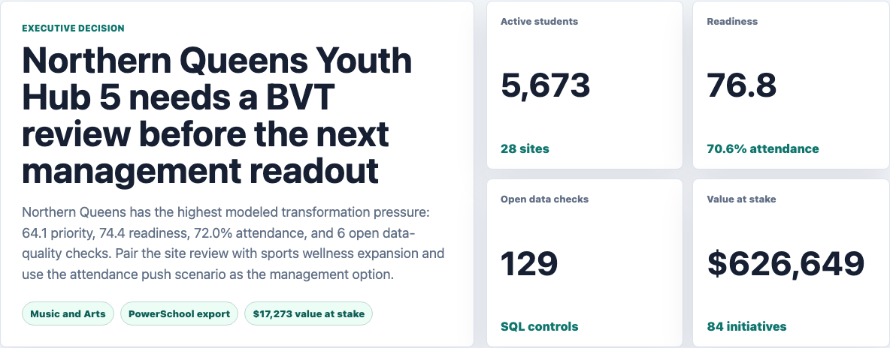
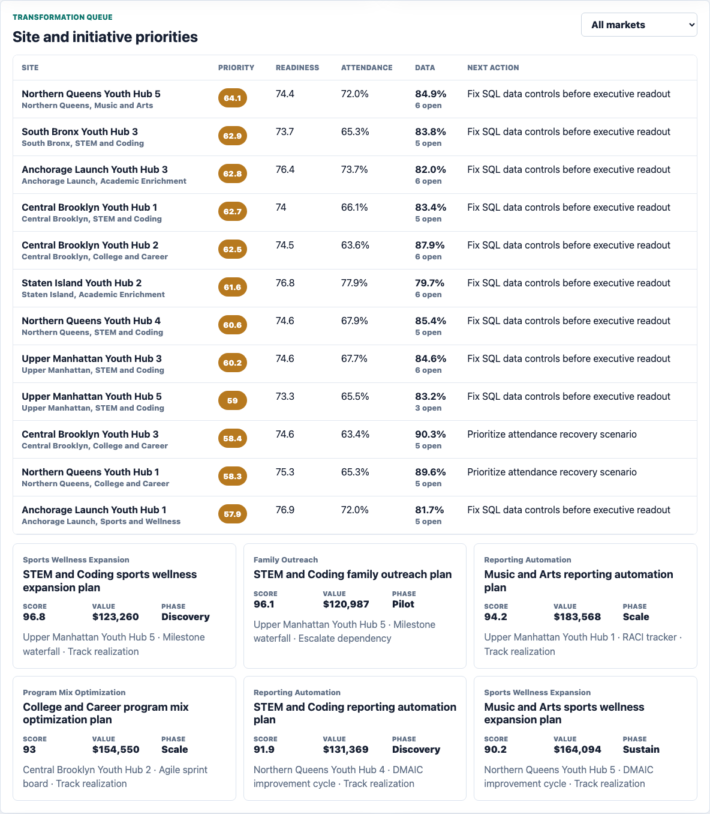
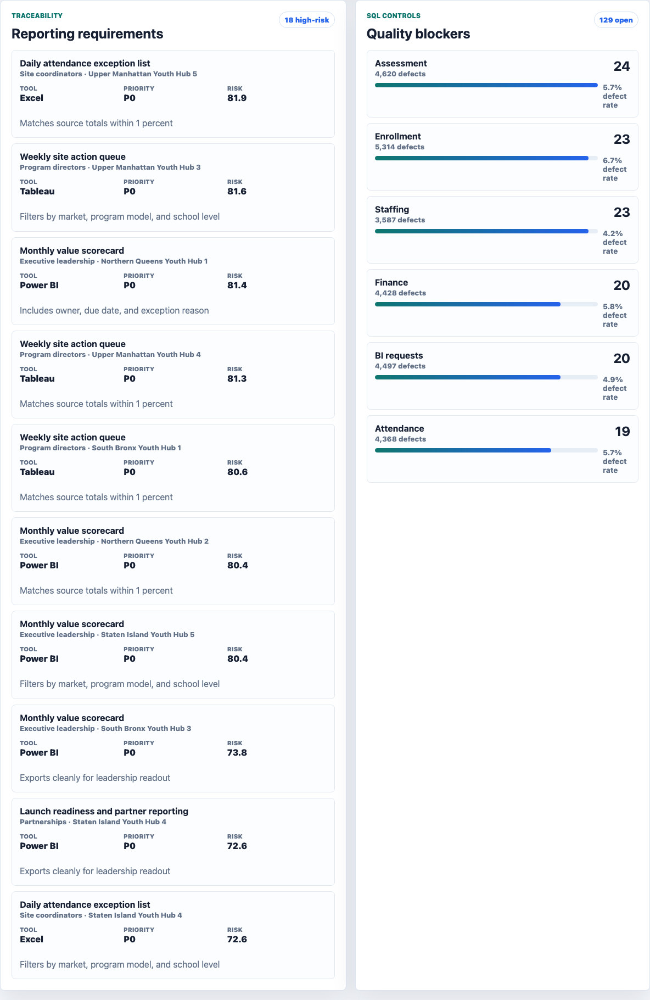
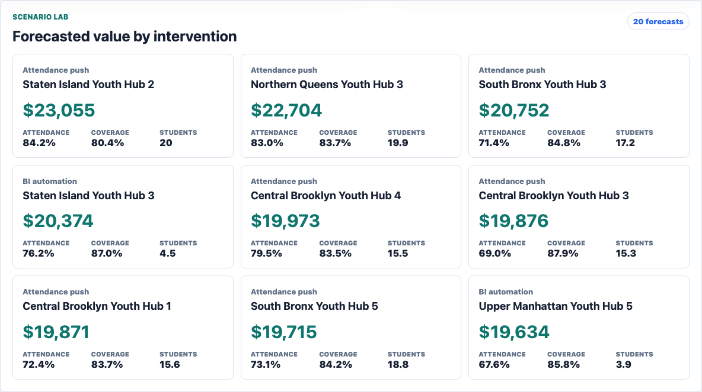

# Youth Program Transformation Value Dashboard

An interactive BVT analyst portfolio artifact for youth enrichment and education program operations. It turns synthetic source data into a stakeholder-ready operating workbench for program transformation, BI requirements, SQL data controls, and scenario forecasting.



Executive cockpit: summarizes portfolio readiness, active students, open data controls, value at stake, market pressure, and the next management decision.



Transformation queue: ranks sites and initiatives by readiness gaps, operating risk, data trust, stakeholder demand, expected value, and project status.



BI requirements and SQL controls: traces stakeholder decision needs to Excel, SQL mart, Tableau, and Power BI delivery targets while showing source-quality blockers.



Scenario lab: forecasts directional value for attendance recovery, reporting automation, staffing coverage, and wellness expansion interventions.

## What This Project Is

This project models the type of work a BVT analyst in a large youth enrichment nonprofit might be asked to do: gather requirements from cross-functional stakeholders, analyze youth-program performance, identify trends and data-quality blockers, communicate recommendations, and monitor the value of implemented strategies.

The app includes four linked views:

- **Executive cockpit:** Portfolio KPIs, top site decision, market readiness, stakeholder demand, and source-quality pressure.
- **Transformation queue:** Ranked site and initiative priorities with recommended next actions.
- **BI requirements:** Requirement traceability across Excel, SQL marts, Tableau, and Power BI.
- **Scenario lab:** Directional forecasts for attendance recovery, BI automation, staffing coverage, and wellness expansion.

## Role Fit

This artifact demonstrates the core work expected in a BVT analyst role:

- Data analysis and reporting across attendance, engagement, staffing, assessment, finance, and data-completeness metrics.
- SQL quality checks for source validation and dashboard trust.
- BI delivery planning for Excel, Tableau, Power BI, and SQL mart outputs.
- Cross-functional stakeholder requirement traceability.
- Project-management methodology fields such as RACI, Agile sprint boards, DMAIC, and milestone planning.
- Education, sports, and wellness program context.

## Data

All data is deterministic synthetic data generated by `scripts/score_operating_data.py` with seed `5262026`. It is modeled on public youth-enrichment operating structures, not on private or real company performance.

Synthetic source tables include:

- `sites.csv`: 28 youth-program hubs across 5 urban markets and 1 regional pilot market. Urban site capacity ranges from 130 to 420 students. Regional pilot capacity ranges from 80 to 180 students.
- `weekly_program_metrics.csv`: 14 weeks of attendance, engagement, homework completion, sports/wellness participation, family touchpoints, staff coverage, incident rate, assessment lift, budget utilization, and data completeness.
- `transformation_initiatives.csv`: 3 BVT initiatives per site across attendance recovery, reporting automation, program mix optimization, staffing, family outreach, and sports/wellness expansion.
- `data_quality_checks.csv`: SQL-style controls for attendance completeness, duplicate enrollment, assessment validity, staffing alignment, finance coding, and BI request SLA.
- `stakeholder_requirements.csv`: reporting requirements by stakeholder group, cadence, BI tool target, source system, priority, acceptance criteria, and status.
- `scenario_assumptions.csv`: directional scenario levers for attendance lift, staff coverage lift, cost change, weekly hours saved, and confidence.

The model uses bounded normal distributions by program model, source system, launch wave, community pressure, and student mobility. Spreadsheet and partner-file source systems receive higher defect-risk assumptions than managed exports. Scenario outputs are directional planning estimates, not audited financial projections.

## Repository Map

| Path | Purpose |
| --- | --- |
| `scripts/score_operating_data.py` | Generates synthetic data, scores readiness and BVT priorities, writes analysis outputs and docs. |
| `analysis/outputs/app_payload.json` | Static app payload for the dashboard. |
| `analysis/outputs/site_readiness.csv` | Site-level readiness and priority queue. |
| `analysis/outputs/initiative_scorecard.csv` | Ranked transformation initiatives. |
| `analysis/outputs/scenario_forecast.csv` | Forecasted scenario value by site. |
| `analysis/outputs/requirement_matrix.csv` | Stakeholder BI delivery-risk queue. |
| `analysis/sql_checks.sql` | SQL examples for data completeness, defects, and requirement traceability. |
| `src/app.js` | Renders the interactive static workbench from generated JSON. |
| `src/styles.css` | Responsive dashboard styling. |

## Run Locally

```bash
npm run analyze
npm start
```

Then open `http://localhost:4173`.

## Scope

This is a static public portfolio artifact with reproducible synthetic data and transparent scoring logic. It does not connect to live student systems, finance systems, enrollment systems, BI servers, Excel workbooks, Tableau, Power BI, or production data. It shows how a BVT analyst can structure data analysis, requirement planning, SQL validation, project prioritization, scenario forecasting, and executive-ready recommendations before a production implementation.
